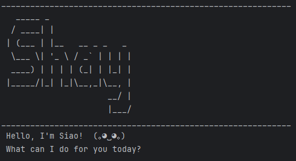

# Siao User Guide


A smart task management assistant that helps you track todos, deadlines and events! 

All through natural language commands via your keyboard.

### Some example commands you can try:
- `list` : List all tasks
- `deadline return book /by Sunday` : Adds a deadline with a description
- `delete 3` : Deletes the 3rd task in the list
- `bye` : Exits the app

# Features Available!
Each addition of a task provides the user with the ability to understand a few things about the task:
1. Type of Task 
2. Is the task done or not?
3. What exactly is the task?
4. Are there timelines to meet?

>  [💡 **NOTE:**]
Notes about the command format:
> 
> - Words in `UPPER_CASE` are the parameters supplied by the user
>   - e.g deadline DESCRIPTION /by DEADLINE
> 

## Adding deadlines

Creates a task with a description and due date.

Format: `deadline DESCRIPTION /by DEADLINE`

Example: `deadline complete CS2113 Quiz /by Friday`
```
expected output
---------------------------------
Got it. I've added this task!
   [D][ ] complete cs2113 quiz (by: friday)
Now you have 7 task(s) in the list
---------------------------------
```

## Adding Events

Creates a task with a description, what time it starts, and what time it ends.

Format: `event DESCRIPTION /from FROM /to TO`

Example: `event Jessica's Wedding /from Sunday 2pm /to 4pm`

```
expected output
---------------------------------
Got it. I've added this task!
   [E][ ] jessica's wedding (from: Sunday 2pm to: 4pm)
Now you have 8 task(s) in the list
---------------------------------
```


## Adding Todos

Creates a task with a description.

Format: `todo DESCRIPTION`

Example: `todo eat chicken rice`

```
expected output
---------------------------------
Got it. I've added this task!
   [T][ ] eat chicken rice
Now you have 9 task(s) in the list
---------------------------------
```

## Displaying List of Task
This allows the user to view what tasks are on his list

Example: `list`

```
expected output
---------------------------------
1. [E][ ] project meeting (from: Aug 6th 2pm to: 4pm)
2. [T][X] join sports club
3. [D][ ] return book (by: sunday)
4. [T][ ] get book
5. [D][ ] return book (by: monday)
6. [T][ ] chicken
7. [D][ ] complete cs2113 quiz (by: friday)
8. [E][ ] jessica's wedding (from: Sunday 2pm to: 4pm)
9. [T][ ] eat chicken rice
---------------------------------
```

## Mark Task
Marks the task as completed

Format: `mark INDEX_OF_TASK`

Example: `mark 9` : which means I've eaten my chicken rice

```
expected output
---------------------------------
Good job on completing the task!
  [T][X] eat chicken rice
---------------------------------
```

## Unmark Task
Marks the task as incomplete

Format: `unmark INDEX_OF_TASK`

Example: `unmark 9` : which means I've not eaten my chicken rice

```
expected output
---------------------------------
Task is not done yet. Why you unmark?
  [T][ ] eat chicken rice
---------------------------------
```

## Find Task
Finds if the task exists in the list

Format: `find KEYWORD`

> [💡 **NOTE:**]
> User can only input ONE keyword

Example: `find quiz`

```
expected output
---------------------------------
Here are the matching tasks in your list:
1. [D][ ] complete cs2113 quiz (by: friday)
---------------------------------
```
## Delete Task
Deletes the N<sup>th</sup> task in the list

Format: `delete INDEX_OF_TASK`

Example: `delete 3`

```
expected output
---------------------------------
Got it. I've deleted this task!
  [D][ ] return book (by: sunday)
Now you have 8 task(s) in the list
---------------------------------
```

## Exit Program
Exits the program

Example: `bye bye`

```
expected output
---------------------------------
Bye bye! Do remember to complete your tasks!
```